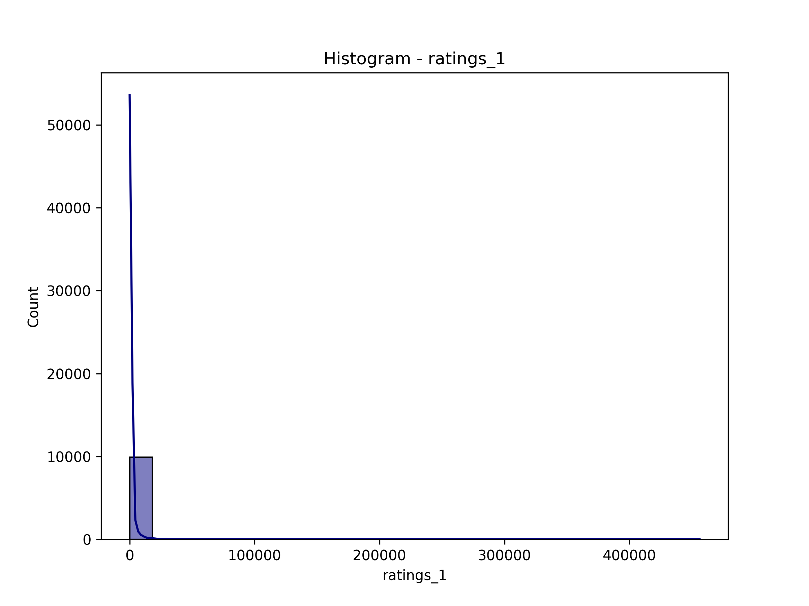

# Data Analysis Report

### Summary of Findings from the Goodreads Dataset

1. **Dataset Overview**:
   - The dataset contains 10,000 entries (books) and 23 columns, encompassing various attributes such as book IDs, authors, publication details, ratings, and review counts.

2. **Missing Data**:
   - Significant missing values were found in the following columns:
     - `isbn`: 700 missing values
     - `isbn13`: 585 missing values
     - `original_publication_year`: 21 missing values
     - `original_title`: 585 missing values
     - `language_code`: 1084 missing values
   - Other columns, such as `authors`, `average_rating`, and `ratings_count`, are complete, indicating good data quality for these attributes.

3. **Statistical Insights**:
   - **Authors**: The dataset features 4,664 unique authors with Stephen King being the most frequently mentioned (60 occurrences).
   - **Ratings**: The average rating across all books is approximately 4.00, with a standard deviation of about 0.25, suggesting that the majority of books are generally well-received.
   - **Publication Year**: The mean original publication year is around 1981, with a range from 1750 to 2017. This indicates a diverse range of books, including both classics and contemporary literature.
   - **Language**: The dataset consists of books in 25 different languages, with English being the most common (6,341 occurrences).
   - **Ratings Distribution**: The distribution of ratings (1 to 5) shows that higher ratings (4 and 5) are more common, with mean counts of approximately 19,965 and 23,789 respectively for ratings of 4 and 5.

4. **Image Availability**:
   - Both `image_url` and `small_image_url` fields have 10,000 entries, indicating that all books have associated images, which is beneficial for visual appeal in applications.

### Recommendations

1. **Data Cleaning**:
   - Address the missing values, particularly in the `isbn`, `isbn13`, `original_publication_year`, `original_title`, and `language_code` fields. Strategies could include:
     - Imputing missing values where feasible.
     - Removing entries with critical missing data if they are not significant to the analysis.

2. **Exploratory Data Analysis (EDA)**:
   - Conduct further analysis to explore relationships between ratings, number of reviews, and publication year. For instance, examining if newer books tend to receive higher ratings or if more established authors have consistently better ratings.

3. **Recommendation System**:
   - Utilize the average ratings and ratings count to develop a recommendation system for users. Books with high average ratings and a substantial number of ratings could be highlighted.

4. **Author Analysis**:
   - Investigate the performance of different authors. This could involve identifying trends in their ratings over time or analyzing the genres they cover.

5. **Language Diversity**:
   - Explore the distribution of ratings across different languages. This could provide insights into whether certain languages or cultures tend to rate books differently.

6. **Visual Enhancements**:
   - Enhance user interfaces of applications using this dataset by including book images, which could draw user attention and improve engagement.

7. **Trend Analysis**:
   - Analyze trends over time in the average ratings and publication years to understand shifts in reader preferences or the impact of specific events (e.g., movie adaptations).

By implementing these recommendations, the value derived from the dataset can be maximized, leading to enhanced user experiences and deeper insights into reading trends.

