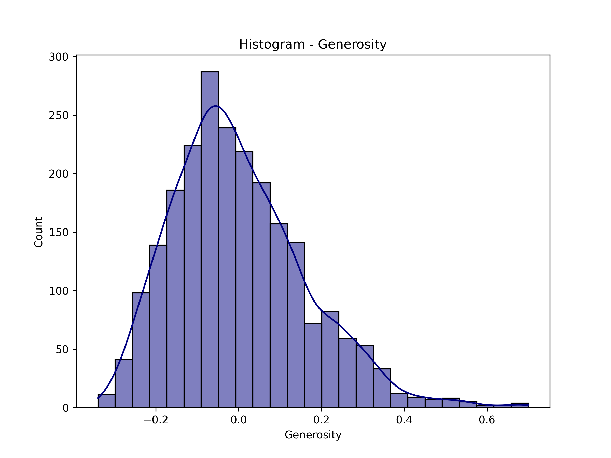

# Data Analysis Report

### Summary of Findings from the Happiness Dataset Analysis

#### Dataset Overview
- **Shape**: The dataset contains 2,363 rows and 11 columns, suggesting a substantial amount of data on happiness metrics across various countries and years.
- **Columns**: The dataset includes key indicators such as Life Ladder (a measure of subjective well-being), Log GDP per capita, Social support, Healthy life expectancy, Freedom to make life choices, Generosity, Perceptions of corruption, Positive affect, and Negative affect.

#### Missing Data
- Missing values are present in several columns:
  - **Log GDP per capita**: 28 missing values
  - **Social support**: 13 missing values
  - **Healthy life expectancy**: 63 missing values
  - **Freedom to make life choices**: 36 missing values
  - **Generosity**: 81 missing values
  - **Perceptions of corruption**: 125 missing values
  - **Positive affect**: 24 missing values
  - **Negative affect**: 16 missing values
- The presence of missing data in key metrics could affect analyses and insights derived from the dataset.

#### Descriptive Statistics
- **Life Ladder**: The average score is approximately 5.48, indicating a moderate level of self-reported well-being. The scores range from 1.281 to 8.019, suggesting significant variation among countries.
- **Log GDP per capita**: The mean is about 9.40, with a range from 5.53 to 11.68. This indicates variations in economic status across countries.
- **Social Support**: The mean score is 0.81, reflecting relatively high levels of perceived social support.
- **Healthy Life Expectancy**: The average is approximately 63.40 years, with a range from 6.72 to 74.60 years, indicating disparities in health outcomes.
- **Freedom to Make Life Choices**: The mean score is 0.75, showing a generally positive perception of personal freedom.
- **Generosity**: The average is very low (0.0001), with many negative values, indicating a potential focus on other factors rather than altruism in many countries.
- **Perceptions of Corruption**: The average score is around 0.74, suggesting that corruption is perceived as a significant issue in many contexts.
- **Positive and Negative Affect**: The mean for positive affect is about 0.65, while negative affect averages 0.27, indicating a generally positive emotional state among respondents.

### Recommendations and Insights
1. **Data Cleaning and Imputation**: Address the missing values using appropriate imputation techniques, such as mean/mode substitution or more sophisticated methods like regression or multiple imputation, to enhance the dataset's completeness and reliability.

2. **Correlation Analysis**: Conduct correlation analyses to explore relationships between the Life Ladder and other variables, such as Log GDP per capita and Social support, to identify key drivers of happiness.

3. **Comparative Analysis**: Perform a comparative analysis of happiness metrics across different regions or income levels to understand global disparities in well-being. 

4. **Focus on Low-Scoring Metrics**: Investigate the factors contributing to low scores in Generosity and Healthy Life Expectancy. Understanding these could provide insights into areas for policy intervention.

5. **Longitudinal Studies**: Given the dataset spans several years, consider conducting longitudinal studies to assess trends in happiness over time and the impact of economic or social changes.

6. **Policy Implications**: Utilize findings to inform policymakers about factors that significantly influence happiness, such as the importance of social support, economic stability, and personal freedoms. 

7. **Public Awareness Campaigns**: Use insights from the analysis to design public awareness campaigns focusing on enhancing social support systems and addressing perceptions of corruption, which may indirectly improve overall happiness.

By addressing the missing data and focusing on the relationships between happiness and its determinants, stakeholders can better understand and improve well-being across different populations.

