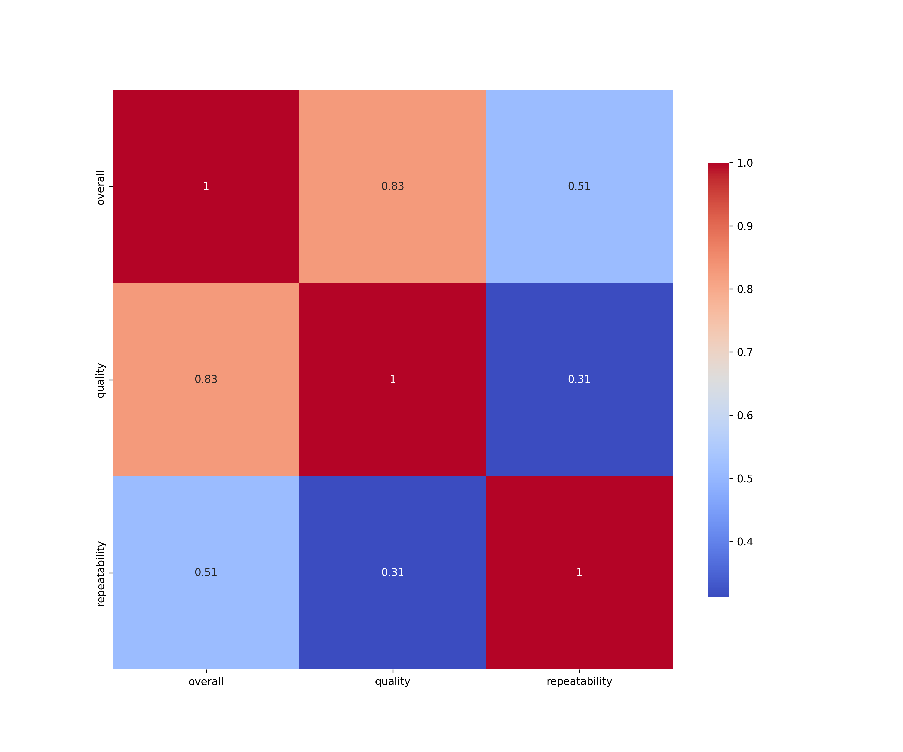
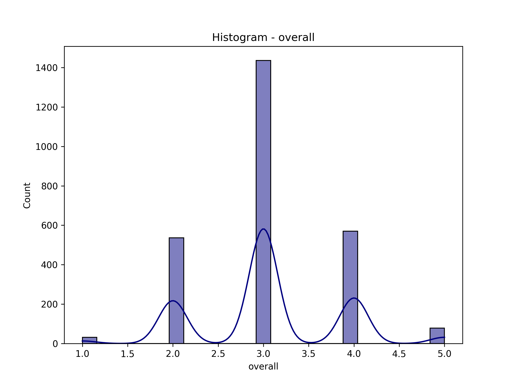
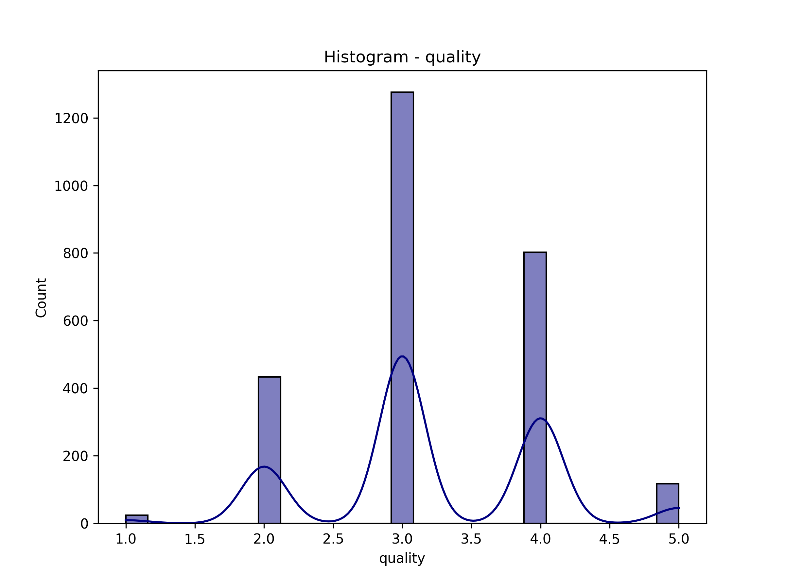
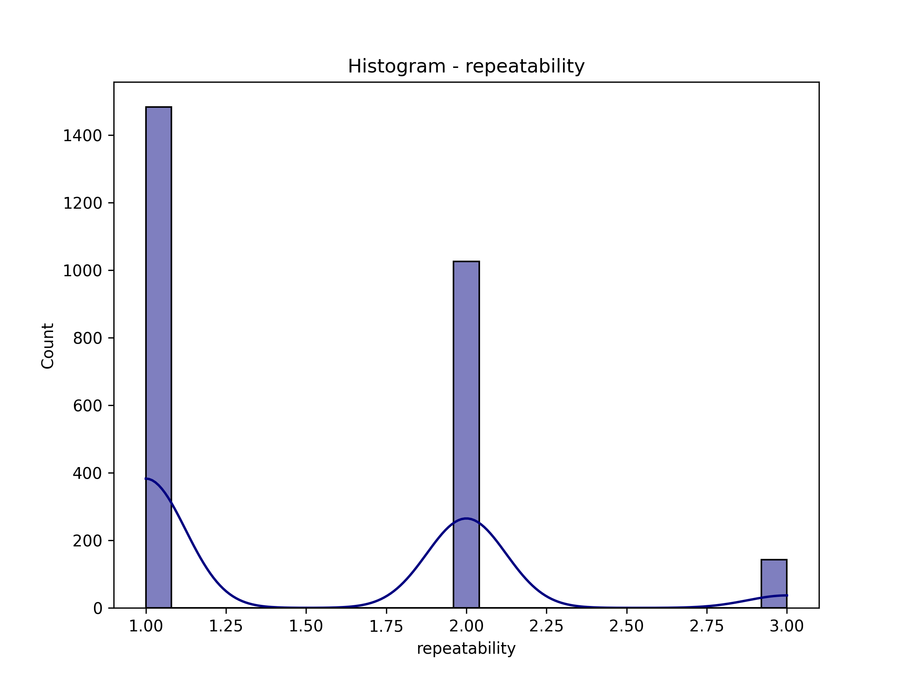

# Data Analysis Report

### Summary of Findings from `media.csv`

1. **Dataset Overview:**
   - The dataset consists of 2,652 entries and 8 columns, detailing media attributes such as date, language, type, title, author (by), overall rating, quality rating, and repeatability.

2. **Missing Data:**
   - The 'date' column has 99 missing values, which represents approximately 3.73% of the dataset.
   - The 'by' column has 262 missing values (9.87%).
   - Other columns do not have missing data.

3. **Statistical Insights:**
   - **Date:** There are 2,553 non-null entries, with 2,055 unique dates. The most frequent date is '21-May-06', which appears 8 times.
   - **Language:** The dataset contains 11 unique languages, with 'English' being the most common, occurring 1,306 times.
   - **Type:** There are 8 unique media types; 'movie' is predominant, with 2,211 occurrences.
   - **Title:** A total of 2,312 unique titles exist, with 'Kanda Naal Mudhal' being the most frequent at 9 occurrences.
   - **Author (by):** 2,390 entries have valid author data, with 1,528 unique authors. 'Kiefer Sutherland' is the most frequent author, appearing 48 times.
   - **Overall Rating:** The average overall rating is approximately 3.05, with a standard deviation of 0.76. Ratings range from 1 to 5.
   - **Quality Rating:** The average quality rating is about 3.21, with a standard deviation of 0.80, also ranging from 1 to 5.
   - **Repeatability:** The average repeatability score is around 1.49, with a standard deviation of 0.60, with values ranging from 1 to 3.

### Recommendations:

1. **Address Missing Data:**
   - Consider imputing missing values in the 'date' and 'by' columns to enhance data completeness. For 'date', if the missing entries are not critical, they could be dropped; however, if they are significant, imputing based on the most common dates or using predictive methods could be explored. For 'by', if possible, attempt to fill in missing author information through external databases or common patterns.

2. **Data Normalization:**
   - Standardize the date format if it is not consistent. This will help in better analysis and visualization of trends over time.

3. **Explore Language Diversity:**
   - Given the presence of multiple languages, consider segmenting analyses based on language to identify trends or preferences within different linguistic demographics.

4. **Analyze Media Types:**
   - Further analysis on the types of media could provide insights into trends over time. For instance, is there a growing preference for certain media types?

5. **Investigate Ratings:**
   - The average ratings (overall and quality) suggest a generally positive reception. However, examining the distribution of these ratings could uncover outliers or trends that warrant deeper exploration. Consider visualizing the distribution of ratings using histograms or box plots.

6. **Author Analysis:**
   - Investigate the most prolific authors to understand if their works significantly influence overall or quality ratings. This could help identify key contributors in the dataset.

7. **Time Series Analysis:**
   - Utilize the date information to perform a time series analysis to observe trends in ratings over time. This could reveal patterns in media reception and quality.

### Insights:
- The dataset is rich with information but has some gaps that, if addressed, could lead to deeper insights. 
- The prominence of 'English' and 'movie' type media could suggest a focus area for further marketing or content development strategies.
- Ratings are generally favorable, indicating a positive reception towards the media covered in the dataset, which could be leveraged for promotional purposes or partnerships.

By following these recommendations, the dataset can be enhanced for more effective analysis and insights generation.

